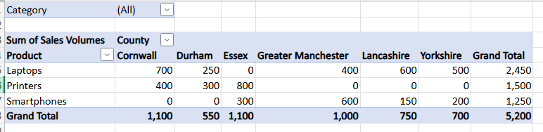

# Bootcamp_Workbooks
# Bootcamp Learning Summary

This summary outlines my learning experience and activities completed during the **Level 3 Data Technician Bootcamp**, which ran over an **eight-week period**. I joined the programme as part of a **career change**, recognising the opportunity to develop in-demand data skills. Throughout the bootcamp, we covered **Excel**, **Tableau** and **Power BI** (combined into one week due to their similarities), **SQL**, **Azure**, and **Python**. I also sought additional experience by exploring other datasets and applying what I had learned. Weeks 4 and 8 focused on **career development** — enhancing our CVs and improving interview skills to increase our employability.

---

## Excel
In the first week, we explored **Excel** and learned how to clean data, use formulas, and produce visualisations such as pivot tables and slicers. One concept that stood out to me was using formulas to categorise data. For instance, in a retail dataset, I used the **SWITCH** function to classify transactions into “high”, “medium”, and “low” ranges based on transaction totals. I particularly enjoyed this topic, as Excel allowed me to approach data analysis more methodically and understand the importance of structured data management.

 
---

## Tableau and Power BI
Next, we moved on to **Tableau** and **Power BI**. These tools were new to me, and I was impressed by how easily they allow the creation of visuals and the building of relationships across datasets. We also discussed the importance of effective data presentation — choosing a tasteful colour palette and keeping visualisations simple to avoid overwhelming the audience. One project that stood out was simplifying data exploration using **hierarchies** in Power BI, which made filtering and interpreting data much clearer.

---

## SQL
The following week focused on **SQL**. Although I had heard of SQL before, I had no prior experience writing queries. I learned how to create databases, establish relationships using **primary** and **foreign keys**, and perform operations such as **SELECT**, **JOIN**, and **WHERE** to filter and retrieve data efficiently. I found this topic particularly engaging and realised how much I enjoy working with programming languages — something I am keen to continue developing in my career.

---

## Azure
Before studying **Azure**, I had little understanding of the importance of cloud computing in modern business. I was amazed by the range of services Azure provides, particularly in data management and pipeline development. During one session, we explored **Azure Cosmos DB**, using it to store and transfer retail transactional data. This gave me valuable insight into cloud-based data storage and scalability.

---

## Python
**Python** was my favourite topic. As mentioned earlier, I discovered a strong interest in programming languages, and Python demonstrated how versatile coding can be in data analytics. I learned how to import, clean, and summarise data using **Pandas**, and later explored **NumPy** for performing complex statistical calculations. This experience deepened my interest in using Python for data manipulation and analysis, and I am eager to continue learning more advanced techniques.

---

## Overall Reflection
Overall, the bootcamp has given me confidence in tools and technologies I had previously only heard of, such as Excel and Azure. I now appreciate how essential they are in the data field. Moving forward, I plan to continue developing my programming skills and applying them to data science projects. My next goal is to design my own projects focused on conducting **statistical analysis within the field of cybersecurity**.

